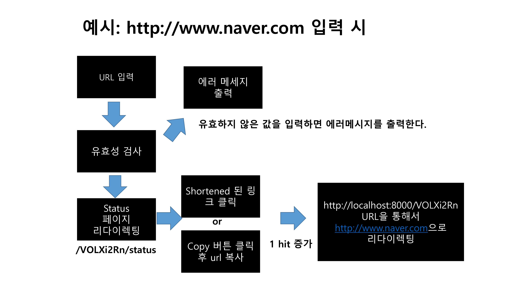
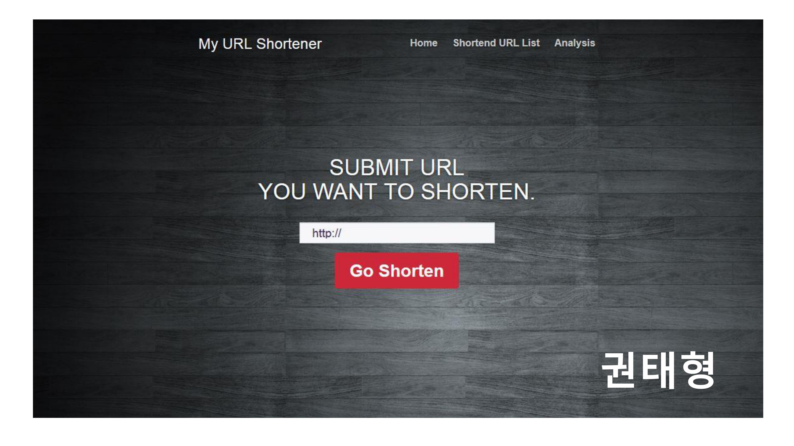
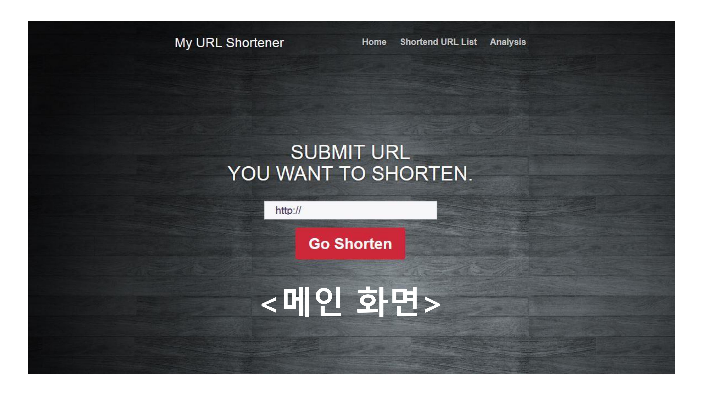
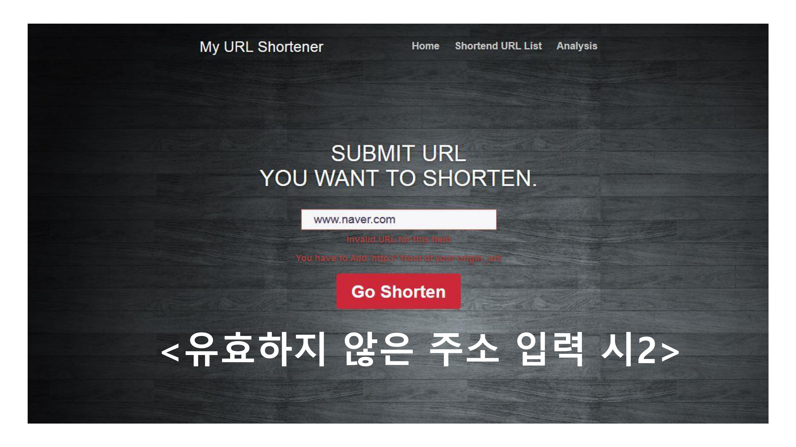
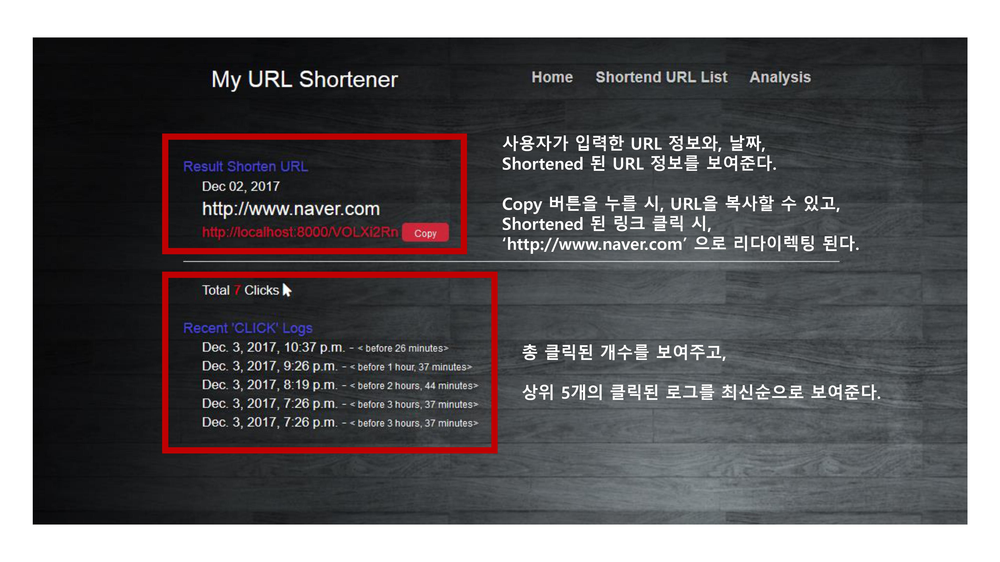
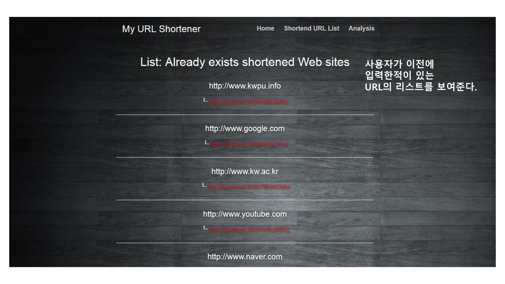

# Simple URL Shortene

> 2017년도 스마일게이트 서버개발 캠프 3기 사전 과제


##### 사용자가 원하는 url을 입력하였을 때, 숫자와 알파벳이 섞인 임의의 6자리로 축약된 주소로 리다이렉팅 해주는 서비스

* 축약된 사이트에 대한 리스트 정보 제공

* 축약된 url 클릭 혹은 입력하였을 때, 

  * 시간 정보 제공
  * 총 클릭 및 입력 횟수 제공

* 전체 입력한 사이트에의 클릭 횟수 그래프 제공

* 실행 Flow

  

[동작 화면 살펴보기](https://youtu.be/Y8Ah07a4M1E)


## Getting Started

### Prerequisites

* Pip3
* Python3


## Run in development

```shell
# In Terminal

# Clone repo
> git clone https://github.com/TaeHyoungKwon/Simple_URL_Shortener.git

# Change directory 
> cd Simple_URL_Shortener

# Install requirements.txt
> pip3 install -r requirements.txt

# Run dev server
> python3 manage.py runserver
```


### Project folder structure

```shell
> tree src -L 2 -C

src
├── db.sqlite3
├── manage.py
├── mysite
│   ├── __init__.py
│   ├── __pycache__
│   ├── settings.py
│   ├── urls.py
│   └── wsgi.py
├── shortener
│   ├── __init__.py
│   ├── __pycache__
│   ├── admin.py
│   ├── apps.py
│   ├── forms.py
│   ├── migrations
│   ├── models.py
│   ├── static
│   ├── templates
│   ├── urls.py
│   ├── utils.py
│   ├── validation.py
│   └── views.py
```


### Dependencies

| Dependence             | Version |
| ---------------------- | ------- |
| **———— Backend ————**  |         |
| Django                 | 1.11.7  |
| django-crispy-forms    | 1.7.0   |
| djangorestframework    | 3.7.3   |
| pytz                   | 2017.3  |
|                        |         |
| **———— Frontend ————** |         |
| bootstrap              | 3.3.2   |
| jquery                 | 2.2.4   |
| chart.js               | 2.7.1   |


--------------


## API Specifications

> Server side rendering 상에서의 Response 값은 생략(html 코드)

### 1.

| Action    | API         | Parameter | Body       | etc                   |
| --------- | ----------- | --------- | ---------- | --------------------- |
| Show Home | GET <br />/ | N/A       | N/A        | Server side rendering |
| Pass Url  | POST<br />/ | N/A       | origin_url | Server side rendering |

* Success Response

  * GET

    ```json
    "GET / HTTP/1.1" 200 5710
    ```

    

  * POST (with csrf token generated by django forms)

    ```json
    "POST / HTTP/1.1" 302 0
    "GET /nB9hNBtP/status HTTP/1.1" 200 6278
    ```

* Failure Response

  * POST

    * User Input invalid Url

      ```python
      #In validation.py
      raise ValidationError("Invalid URL for this field")
      ```

    * User input url without "http://"

      ```python
      #In validation.py
      raise ValidationError("You have to Add 'http://' front of your origin_url!")   
      ```

### 2.

| Action           | API                             | Parameter                   | Body | Etc                   |
| ---------------- | ------------------------------- | --------------------------- | ---- | --------------------- |
| Show Detail Page | GET<br />/{shorened_url}/status | shortened_url = ex)gM116nrJ | N/A  | Server side rendering |

- Success Response

  ```json
  "GET /O69i2IU2/status HTTP/1.1" 200 6278
  ```

- Failure Response

  - Invalid shortened_url

    ```json
    "GET /O69i2IU212/status HTTP/1.1" 404 1750
    ```

    

### 3.

| Action              | API                       | Parameter                   | Body | Etc                   |
| ------------------- | ------------------------- | --------------------------- | ---- | --------------------- |
| Redirect Origin Url | GET<br />/{shortened_url} | shortened_url = ex)gM116nrJ | N/A  | Server side rendering |

- Success Response

  ```json
  "GET /78HWZk8w/ HTTP/1.1" 302 0
  ```

- Failure Response

  - Invalid shortened_url

  ```json
  "GET /gM116nrJ1 HTTP/1.1" 404 1737
  ```


### 4.

| Action        | API            | Parameter | Body | Etc                   |
| ------------- | -------------- | --------- | ---- | --------------------- |
| Show Url List | GET<br />/list | N/A       | N/A  | Server side rendering |

- Success Response

  ```json
  "GET /list HTTP/1.1" 200 8754
  ```

  

### 5.

| Action        | API                | Parameter | Body | Etc                   |
| ------------- | ------------------ | --------- | ---- | --------------------- |
| Show Analysis | GET<br />/analysis | N/A       | N/A  | Server side rendering |

- Success Response

  ```json
  "GET /analysis HTTP/1.1" 200 4918
  ```

### 6.

| Action            | API                  | Parameter | Body | Etc  |
| ----------------- | -------------------- | --------- | ---- | ---- |
| Manage Chart Data | GET<br />/chart/data | N/A       | N/A  | Ajax |

- Success Response

  ```json
  "GET /chart/data HTTP/1.1" 200 277
  
  {
      "labels": [
          "http://www.naver.com",
          "http://www.youtube.com",
          "http://www.kw.ac.kr",
      ],
      "default": [
          14,
          4,
          7,
          6,
          7,
          0,
          0,
          0,
          0,
          0
      ]
  }
  ```


## Requirements

>  URL을 입력 받아 짧게 줄이고, 생성된 짧은 URL을 입력하면 원래 URL로 리다이렉트 해주는 URL 단축 서비스를 개발하시오.


예제

INPUT : http://example.com/example1/example2

OUTPUT : http://localhost/21oNcy


기능

1. URL 입력 폼 제공
2. 단축 후 결과 출력
3. 동일한 URL 입력할 경우 항상 동일한 shortening 결과 값이 나와야 함
4. shortening의 결과 값은 8문자 이내로 생성
5. 브라우저에서 shortening URL을 입력하면 원래 URL로 리다이렉트
6. 도메인은 localhost로 처리


## How to solve problems

기능

1. URL 입력 폼 제공

   > * 처음 들어오는 메인 페이지에서, URL을 입력 받도록 구현
   > * bootstrap template 이용하여서 프론트 단 구현

2. 단축 후 결과 출력

   > * http://localhost/{단축된 URL}/status 에서 확인 가능
   > * 메인 화면에서 URL 입력시, 위의 주소로 리다이렉트 하도록 구현

3. 동일한 URL 입력할 경우 항상 동일한 shortening 결과 값이 나와야 함

   > * 기존 데이터베이스에 존재 하는 URL을 입력하였을 시, 해당 URL로 미리 만들어진 status 페이지로 리다이렉팅

4. shortening의 결과 값은 8문자 이내로 생성

   > * 알파벳 소문자, 대문자, 숫자를 활용하여서, random으로 문자열을 생성하도록 함

5. 브라우저에서 shortening URL을 입력하면 원래 URL로 리다이렉트

   > * 서버를 켜놨을 시, 해당 URL 입력했을 때, 서버 상에 구현된 Controller 로직을 타도록 하였음

6. 도메인은 localhost로 처리


## Further More

- [ ] 코드 리팩토링

  - [ ] Views.py
    - [ ] 단위 테스트 코드 작성
    - [ ] 중복 코드 제거
    - [ ] 실패했을 때에 대한 예외 코드 작성
  - [ ] models.py
    - [ ] 필요 없는 컬럼 삭제
    - [ ] 테이블 삭제
    - [ ] 테이블 관계 설정 수정
  - [ ] Template
    - [ ] 중복 코드 제거

- [ ] Swagger로 api 정리

- [ ] Circle Ci 달기

- [ ] 문제해결 추가

- [ ] Requirements 추가

  

  

-----------


## Screens
















